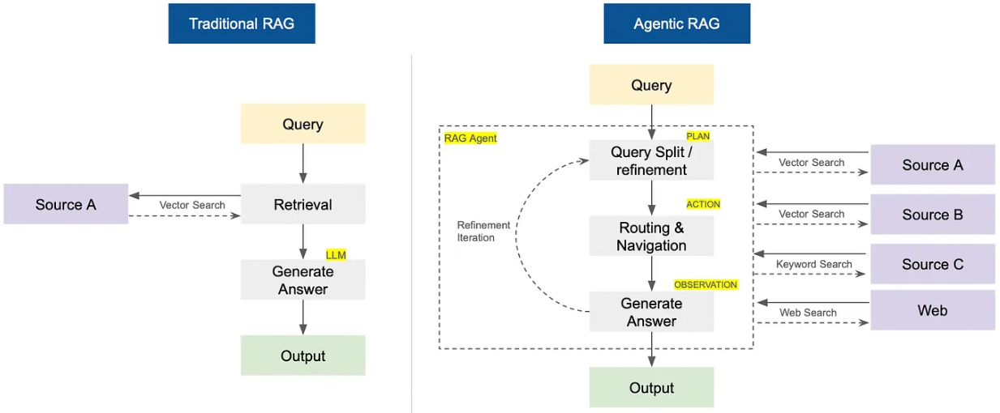

# <h1 align="center">Build Agentic RAG using LangGraph</h1>

Senior Data Scientist.: Dr. Eddy Giusepe Chirinos Isidro

Aqui construímos um sistema Retrieval-Augmented Generation (``RAG``) com capacidade AGENTE, que não só recupera informações de fontes externas como também age ou executa tarefas baseadas nelas.
 

## Datasets Médicos

### Comprehensive Medical Q&A Dataset

O conjunto de dados ``MedQuad`` fornece uma fonte abrangente de perguntas e respostas médicas para processamento de linguagem natural. Com mais de ``43.000`` consultas de pacientes em situações da vida real, ``categorizadas em 31 tipos distintos de perguntas``, o conjunto de dados oferece uma oportunidade inestimável para pesquisar correlações entre tratamentos, doenças crônicas, protocolos médicos e muito mais. As respostas fornecidas neste banco de dados vêm não apenas de ``médicos``, mas também de outros profissionais de saúde, como ``enfermeiros`` e ``farmacêuticos``, fornecendo um conjunto mais completo de respostas para ajudar os pesquisadores a obter insights mais profundos no âmbito da saúde.

O arquivo ``train.csv`` no conjunto de dados ``MedQuad`` contém perguntas e respostas relacionadas a condições médicas, tratamentos e protocolos. Este conjunto de dados foi obtido no ``Kaggle`` e pode ser encontrado [aqui](https://www.kaggle.com/datasets/thedevastator/comprehensive-medical-q-a-dataset). Este dataset tem as seguintes colunas:

- ``qtype``: O tipo de pergunta médica. (String)
- ``Question``: A questão médica colocada pelo paciente. (String)
- ``Answer``: A resposta especializada à pergunta médica. (String)

### Medical Device Manuals Global Dataset 2025

Este conjunto de dados sintéticos abrangente contém ``2.694`` registros de manuais de instruções de dispositivos médicos com ``16`` colunas estruturadas, projetados para análises de assistência médica, análise de conformidade regulatória e aplicações de pesquisa de dispositivos médicos. Este conjunto de dados, também, foi obtido no ``Kaggle`` e pode ser encontrado [aqui](https://www.kaggle.com/datasets/pratyushpuri/global-medical-device-manuals-dataset-2025). Este dataset tem as seguintes colunas:

- ``Device_Name``: Nome do dispositivo médico. (String)
- ``Model_Number``: Número do modelo do dispositivo. (String)
- ``Manufacturer``: Empresa fabricante do dispositivo. (String)
- ``Manual_Version``: Versão do manual do produto. (String)
- ``Publication_Date``: Data de publicação do manual. (DateTime)
- ``Device_Class``: Classe regulatória do dispositivo (Class I, II, III, etc.). (String)
- ``Regulatory_Approval_ID``: Identificador de aprovação regulatória. (String)
- ``Patient_Population``: População alvo de pacientes (Adulto, Pediátrico, Geriátrico, etc.). (String)
- ``Indications_for_Use``: Indicações de uso do dispositivo. (String)
- ``Contraindications``: Contraindicações para o uso do dispositivo. (String)
- ``Sterilization_Method``: Método de esterilização aplicável ao dispositivo. (String)
- ``Number_of_Warnings``: Número de avisos de segurança no manual. (Numeric)
- ``Number_of_Cautions``: Número de precauções de uso no manual. (Numeric)
- ``Device_Lifetime_Years``: Tempo de vida útil do dispositivo em anos. (Numeric)
- ``Device_Weight_kg``: Peso do dispositivo em quilogramas. (Numeric)
- ``Max_Operating_Temperature_C``: Temperatura máxima de operação em graus Celsius. (Numeric)

Thank God!